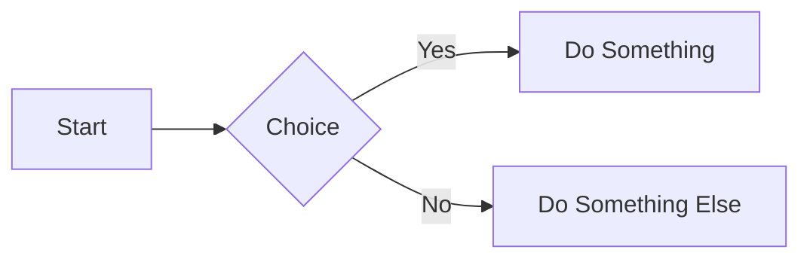

# SaaS Project 3 - Ultimate MDX Capabilities Showcase

Welcome to an exhaustive exploration of MDX's dynamic features, integrations, and advanced patterns. Below you'll find a detailed list of examples demonstrating the high flexibility and possibilities unlocked by using MDX.

## 1. Import and Use React Components
**Description:** Seamlessly integrate interactive UI elements within Markdown.
```jsx
import { Card } from 'shadcn-ui';

<Card title="MDX Card">This is a React card rendered in MDX.</Card>
```

## 2. Live Code Playground
**Description:** Embed editable examples for real-time coding demos.
```jsx
import { Playground } from 'mdx-live';

<Playground code={`function Toggle() {
  const [on, setOn] = React.useState(false);
  return <button onClick={() => setOn(o => !o)}>{on ? 'ON' : 'OFF'}</button>;
}`} />
```

## 3. Dynamic Imports (Next.js)
**Description:** Lazily load heavy components on the client side to optimize bundle size.
```jsx
import dynamic from 'next/dynamic';

const Chart = dynamic(() => import('../components/Chart'), { ssr: false });
<Chart data={[{ x: 1, y: 2 }, { x: 3, y: 4 }]} />
```

## 4. GraphQL Data Fetching (Gatsby)
**Description:** Pull data at build time using GraphQL queries.
```jsx
import { graphql, useStaticQuery } from 'gatsby';

const data = useStaticQuery(graphql`{
  site { siteMetadata { title } }
}`);

<h1>{data.site.siteMetadata.title}</h1>
```

## 5. Custom Shortcodes and Components
**Description:** Define reusable custom components for consistent styling.
```jsx
import Callout from '../../components/Callout';

<Callout type="warning">Remember to sanitize user input!</Callout>
```

## 6. Admonitions via Remark
**Description:** Render styled callouts using simple syntax.
```md
:::note
This is a note admonition rendered by a Remark plugin.
:::
```

## 7. Interactive Tabs
**Description:** Structure content in tabbed interfaces for cleaner layouts.
```jsx
import { Tabs, TabList, Tab, TabPanel } from '@reach/tabs';

<Tabs>
  <TabList>
    <Tab>Overview</Tab>
    <Tab>Examples</Tab>
    <Tab>API</Tab>
  </TabList>
  <TabPanel>Overview content here.</TabPanel>
  <TabPanel>Examples content here.</TabPanel>
  <TabPanel>API reference here.</TabPanel>
</Tabs>
```

## 8. Embedded CodeSandboxes
**Description:** Embed live sandboxes or pen environments for full demos.
```jsx
<iframe
  src="https://codesandbox.io/embed/new"
  style={{ width: '100%', height: 400, border: 0 }}
  title="Live Sandbox"
/>
```

## 9. Mermaid Diagrams
**Description:** Add diagrams and flowcharts with Mermaid syntax.


## 10. Math Rendering with KaTeX
**Description:** Display inline and block math expressions.
```jsx
import { InlineMath, BlockMath } from 'react-katex';

Inline: <InlineMath math="\sqrt{a^2 + b^2}" />
<BlockMath math="\int_0^\infty e^{-x} dx = 1" />
```

## 11. Theming via MDXProvider
**Description:** Apply global theme components to MDX elements.
```jsx
import { MDXProvider } from '@mdx-js/react';
import theme from '../theme';

const components = { h1: props => <h1 style={{ color: theme.primary }} {...props} /> };

<MDXProvider components={components}>
  <Content />
</MDXProvider>
```

## 12. Frontmatter Metadata Utilization
**Description:** Expose frontmatter fields as variables in your content.
```jsx
export const sidebar = false;
<p>Sidebar disabled: {sidebar.toString()}</p>
```

## 13. Native Collapsible Sections
**Description:** Use HTML `<details>` for collapsible content areas.
```html
<details>
  <summary>Advanced Details</summary>
  <p>Here are the advanced details shown on expand.</p>
</details>
```

## 14. Interactive Forms & State Management
**Description:** Integrate React forms and state hooks.
```jsx
function FeedbackForm() {
  const [feedback, setFeedback] = React.useState('');
  return (
    <form onSubmit={e => { e.preventDefault(); alert(feedback); }}>
      <input
        value={feedback}
        onChange={e => setFeedback(e.target.value)}
        placeholder="Your feedback"
      />
      <button type="submit">Send Feedback</button>
    </form>
  );
}

<FeedbackForm />
```

## 15. Static Props & Pre-rendered Data (Next.js)
**Description:** Fetch and pass data at build time for static generation.
```jsx
export async function getStaticProps() {
  const res = await fetch('https://api.example.com/data');
  const data = await res.json();
  return { props: { data } };
}
```

## 16. SWR & Client-side Data Fetching
**Description:** Fetch and cache live data in the browser.
```jsx
import useSWR from 'swr';

function UserList() {
  const { data } = useSWR('/api/users', fetcher);
  return data
    ? <ul>{data.map(u => <li key={u.id}>{u.name}</li>)}</ul>
    : <p>Loading...</p>;
}

<UserList />
```

## 17. MDX Component Composition
**Description:** Break content into modular MDX files and compose them.
```jsx
import IntroSection from './intro.mdx';
import FeatureList from './features.mdx';

<IntroSection />
<FeatureList />
```

## 18. Internationalization (i18n)
**Description:** Integrate translation hooks for multilingual support.
```jsx
import { useTranslation } from 'react-i18next';

const { t } = useTranslation();
<h2>{t('welcome_message')}</h2>
```

## 19. Auto-generated Table of Contents
**Description:** Leverage Remark plugins to generate a TOC.
```md
<!-- toc -->
```

## 20. Plugin Extensibility with Remark/Rehype
**Description:** Extend Markdown parsing and transform content via plugins.
```js
// next.config.js
const withMDX = require('@next/mdx')({
  extension: /\.mdx?$/,
  options: {
    remarkPlugins: [require('remark-slug'), require('remark-autolink-headings')],
  },
});
module.exports = withMDX({ pageExtensions: ['js', 'jsx', 'mdx'] });
```
